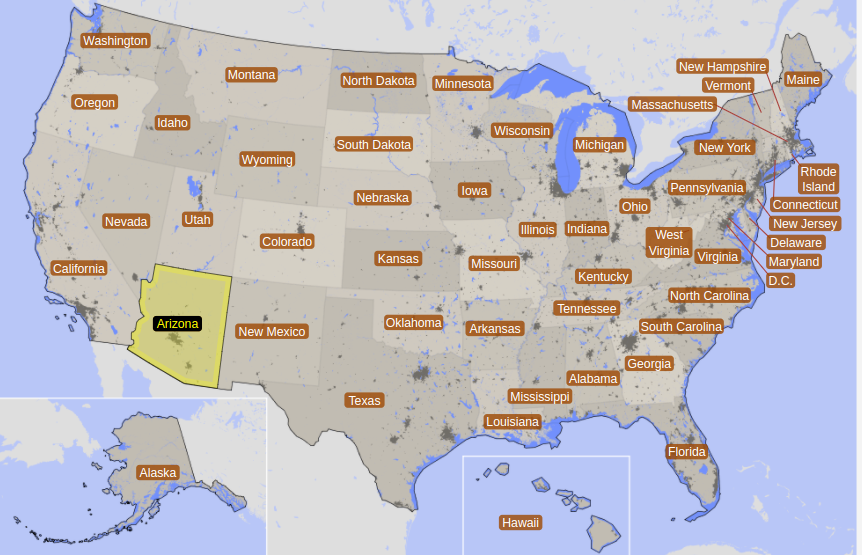
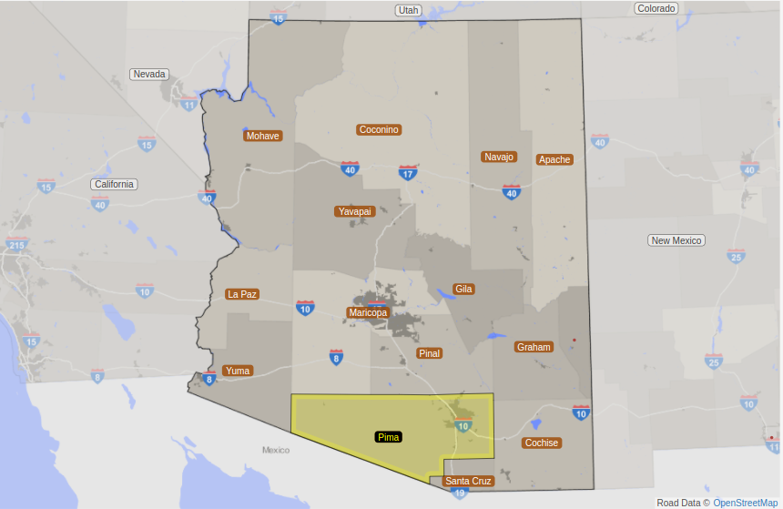
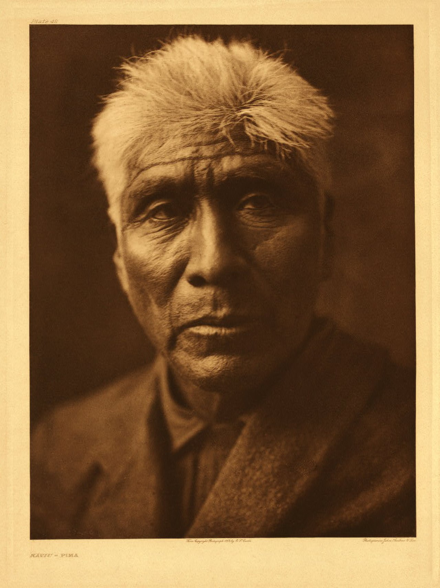

# <h1 align="center" id="heading">**Predibilidade de diabetes em mulheres do grupo Pima**</h1>

### **Introdução ao grupo étinico Pima**[^1]

O grupo Pìma são um grupo de nativos americanos localizados na área ao sul da Arizona, bem próximo a fronteira com o México.

Mapa dos EUA[^2] | Mapa do Arizona[^3]
:-----------:|:---------------:
 | 

O povo Pima tem os maiores níveis de diabetes tipo 2 no mundo, correspondendo a 34,2% dos homens Pima e 40,8% das mulheres pimas, em contraste com a média de 9,3% da população dos EUA.  
Estudo biomedicos indentificaram causas geneticas sobre a prevalência de diabetes sobre este grupo. No entanto, o aumento significativo dos casos de diabetes sobre esse grupo, ressaltam que fatores históricos-sociais e epigenéticos também influenciaram para este cenário.  
Os indígenas Pima viveram por mais de 2 mil anos de forma saudável, vivendo de agricultura e esportes. Porém, entre 1866-1890, através de ações promovidas pelos colonizadores, a tribo viveu com uma queda de 70% da água que usavam para irrigação. Em 1928, a represa Coolidge diminuiu ainda mais a oferta de água, impossibilitando a agricultura e a caça local.  

    
    <figcaption>Represa Coolidge</figcaption>

Desta forma, a tribo Pima enfrentou uma mudança bruta no estilo de vida e de alimentação. Eles começaram a ficar sedentários e a viver de rações que o governo provia, esta ração era uma dieta de pão, queijo e mortadela. Na metade do século XX, o governo alterou a oferta de comida, substituindo por processados com pouca fibra e alto teor de gordura. Essa combinação de sedentarismo e comida de baixa qualidade contribuiram para obesidade e, consequentemente, o aumento do fator de risco para a diabetes. *Muitos indiginas Pima consideram esses acontecimentos como uma tentativa de genocídio*.
 

    
    <figcaption>Kaviu, um ancião Pima[^4]</figcaption>

### **Características dos dados**

Os dados obtidos provêm do National Institute of Diabetes and Digestive and Kidney diseases (NIDDK), pertencente ao United States National Instituties of Health. O grupo analisado conta com *768 mulheres* da etnia Pima, de uma região próxima de Phonex, Arizona, EUA. Este grupo tem um risco mais elevado de desenvolver diabetes e nefropatia diabética e, por isso, é interessante encontrar uma forma de prever a condição de saúde da paciente.  
O objetivo destes dados é prever diagnosticamente a possibilidade da paciente desenvolver diabetes com base em algumas características médicas da pessoa. Para cada mulher, há 8 ~~(9)~~ colunas com dados que podem ajudar a rede a encontrar um padrão, além de mais uma coluna que já nos informa se a paciente já vive (ou não) com diabetes. Abaixo segue mais informações sobre as colunas:
1. Gravidez;
    - Quantidade de vezes em que a paciente já engravidou.
2. Níveis de glicose (**mg/dl**):
    - Realizado Teste Oral de Tolerância a Glicose (TOTG): foi administrado 75g de glicose para a paciente após 8-12 horas de gejum. São coletado 3 amostras de sangue: uma antes da ingestão, a segunda após uma hora da ingestão e uma terceira após 2 horas da ingestão. Depois é feito uma média dos resultados.  
3. Pressão sanguínea (**mmHg**):
    - Pressão sanguínea diastólica.  
4. Dobra cutânea do tríceps (**mm**):
    - Com o uso de um adipômetro, verifica-se a grossura do tecído adiposo no tríceps.  
5. Insulina (**mu U/ml**):
    - É coletado sangue da paciente e medido os níveis de insulina sérica no sangue após 2 horas da administração.  
6. Índice de massa corporal - IMC (**kg/m²**);
    - O IMC é um cálculo realizado para avaliar se uma pessoa está detro, acima ou abaixo de seu peso ideal. a fórmula do imc é dada por: 
    $$IMC=\frac{peso(kg)}{altura²(m²)}$$
7. Função da linhagem de diabetes[^5]:
    - Em inglês, Diabeties Pedigree Function (DPF) é uma função que tenta demonstrar a probabilidade de uma pessoa viver com diabetes com base em histórico da família. Para mais informações consulte o rodapé. A função é dada pela seguinte fórmula:
    $$DPF=\frac{\sum\limits_{i}^{n}K_i(88-ADM_i)+20}{\sum\limits_{j}^{n}K_j(ALC_j-14)+50}$$
    $K_x$ é a porcentagem de genes compartilhados com o $relativo_x$  
    $ADM_i$ é a idade do relativo quando recebeu o diagnóstico de diabetes  
    $ALC_j$ é a idade do relativo em que seu último exame não detectou a diabetes.
8. Idade;
    - Idade da paciente no momento em que foi realizado a coleta de dados. A idade mínima para o experimento era de 21 anos.
9. ~~Tipo sanguíneo;~~
    - ~~O arquivo local não apresenta tipo sanguíneo, mas o arquivo que o programa pode baixar contém esses dados;~~
10. Informção se a paciente vive com ou sem diabetes:
    - Informação de valor booleano, servirá como saída e para comparação da rede. Para entender o dado: 
    $$
    f(x)=
    \begin{cases}
    1, & \quad \text{se vive \textbf{com} diabetes}\\ 
    0, & \quad \text{se vive \textbf{sem} diabetes}
    \end{cases}
    $$

[^1]: Para mais informações sobre influências históricas-sociais sobre a saúde dos povos Pima, acesse: [link](https://www.iiste.org/Journals/index.php/PPAR/article/viewFile/36261/37258).
[^2]: Imagem retirada do site: [statisticalatlas.com](https://statisticalatlas.com/United-States/Overview).
[^3]: Imagem retirada do site: [statisticalatlas.com](https://statisticalatlas.com/state/Arizona/Overview).
[^4]: Imagem retirada dos site: [stringfixer.com](https://stringfixer.com/pt/Pima_people).
[^5]: Para mais informações sobre o cálculo da "Diabeties Pedigree Function" acesse: [link](https://www.ncbi.nlm.nih.gov/pmc/articles/PMC2245318/pdf/procascamc00018-0276.pdf).

